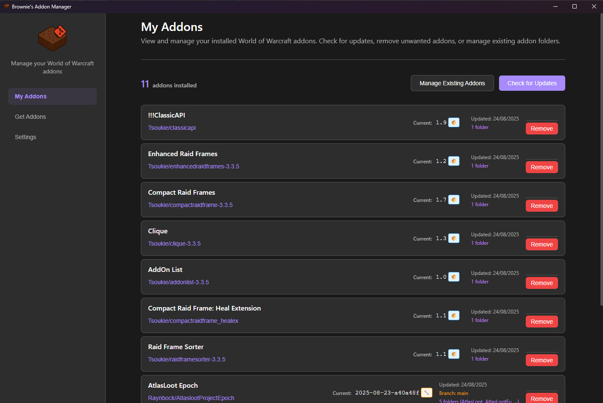
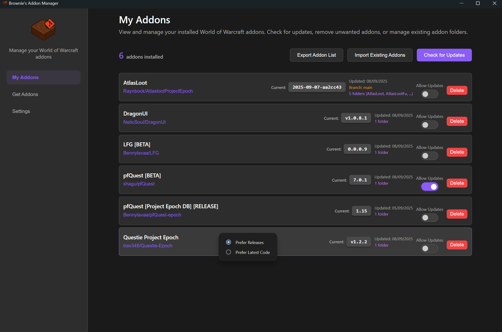
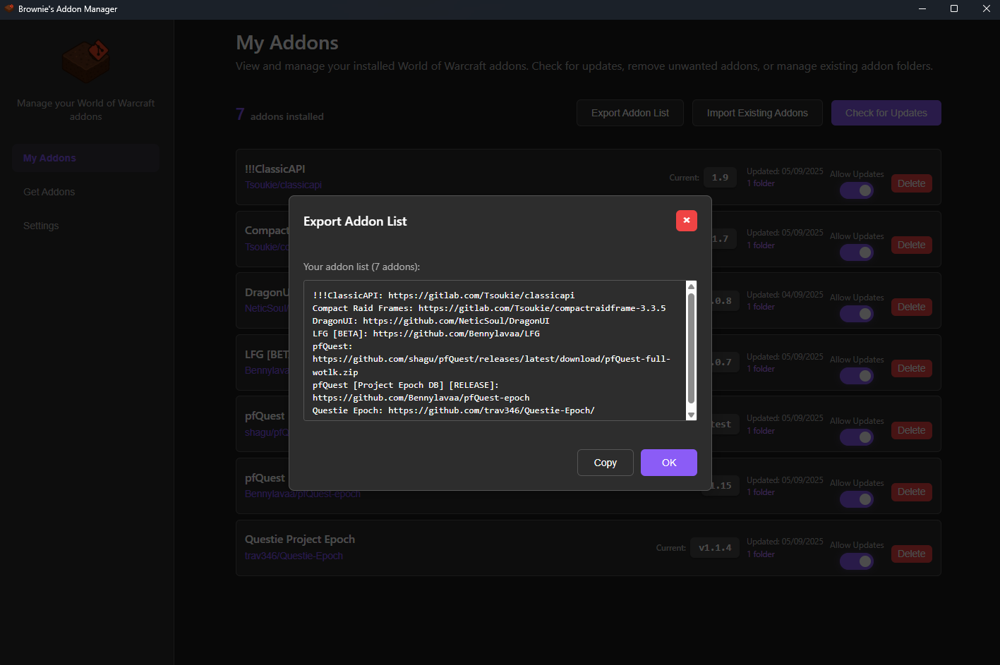
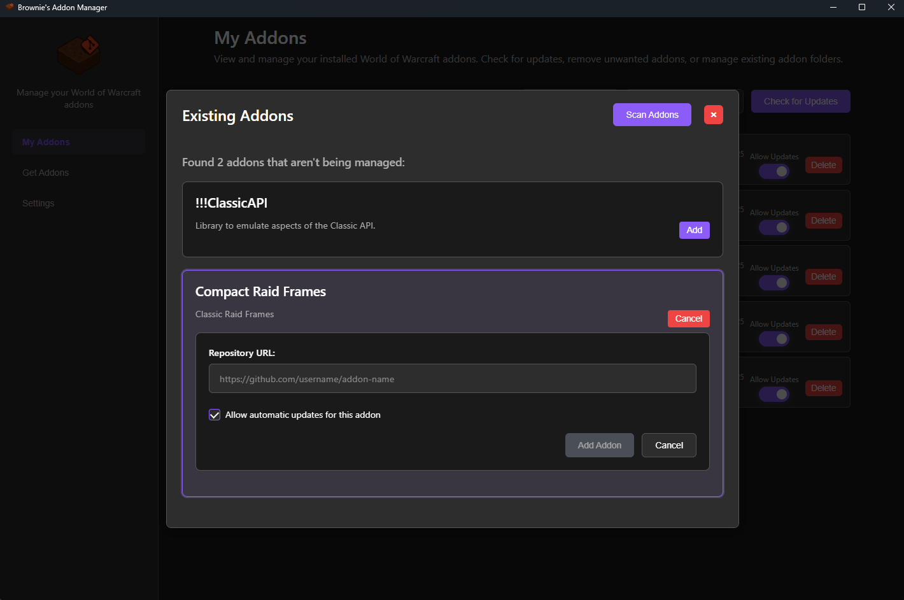
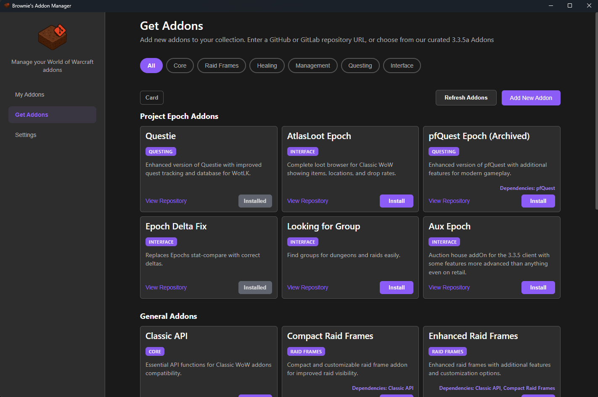
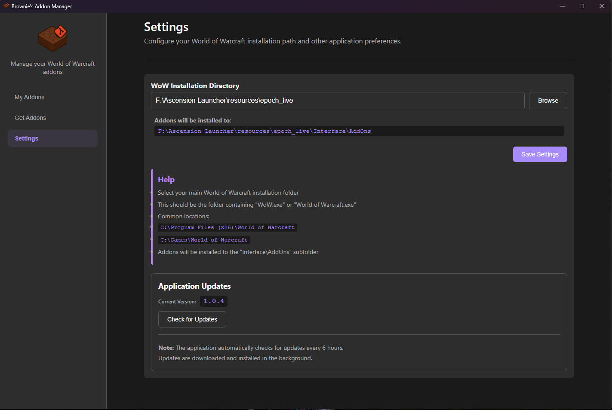

<h1>About</h1>
I wanted a simple application to help with updating addons for Project Epoch so I used claude to create this.

It currently allows installing/updating of addons from both github and gitlab using releases/tags or code. 
Provides a few addons for 3.3.5a as one-click installs.

Built using React & Electron

***
### Current Features
- Add new github/gitlab addons.
- Import existing addons (Requires a github/gitlab URL for the addon)
- Check for and download new updates.
- Enable or Disable Update checking per addon.
- Allows per addon choice of using either releases or source code.
- Curated list of addons as one click installs for 3.3.5 with a Project Epoch specific section.
  -  (This is a manually updated list, if a repository is moved/deleted the install will fail)
- Export a list of your managed addons to help out your friends and guildies.

***
### Planned Features
- Import a list of addons (No Timeline).

If you have feature suggestions please open an issue.

***
### Known Issues

- If your WoW directory is in Program Files then you will need to run this as admin.

Please create a github issue for any problems you find and I'll take a look at some point.

***
### Installation

Download the latest Windows installer from the releases page and run it:

- Latest release (installer): https://github.com/LoneBrownie/AddonManager/releases/latest

***

### Screenshots

***
### Acknowledgments
Our AI overlords Claude and ChatGPT.

My guildies for early testing.

***

### Support Development

If you find this addon manager helpful, consider [buying me a coffee](https://buymeacoffee.com/LoneBrownie).
