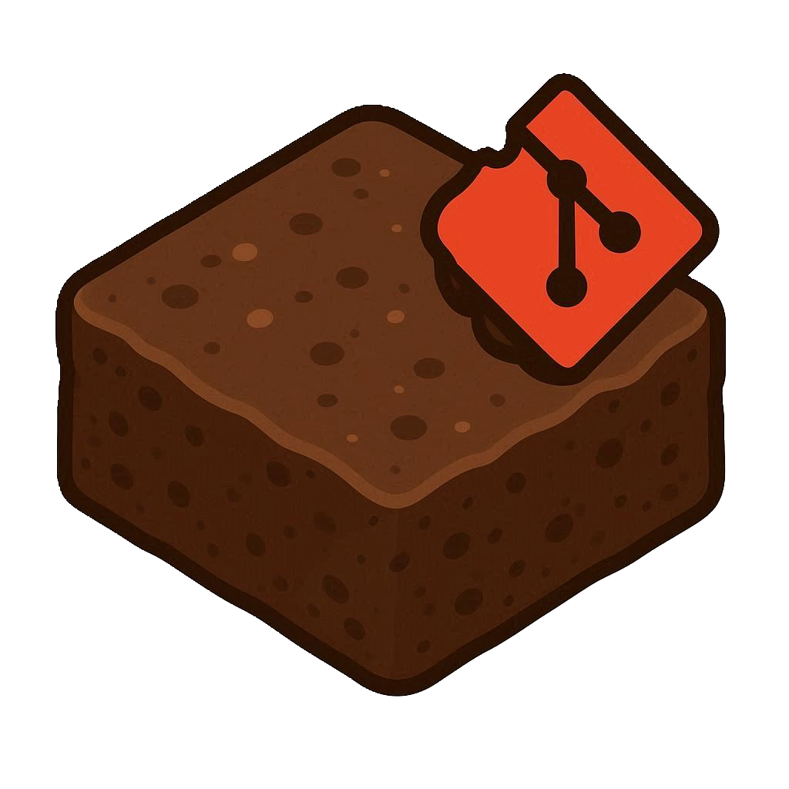
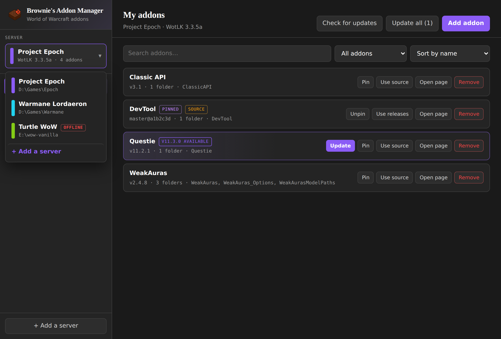
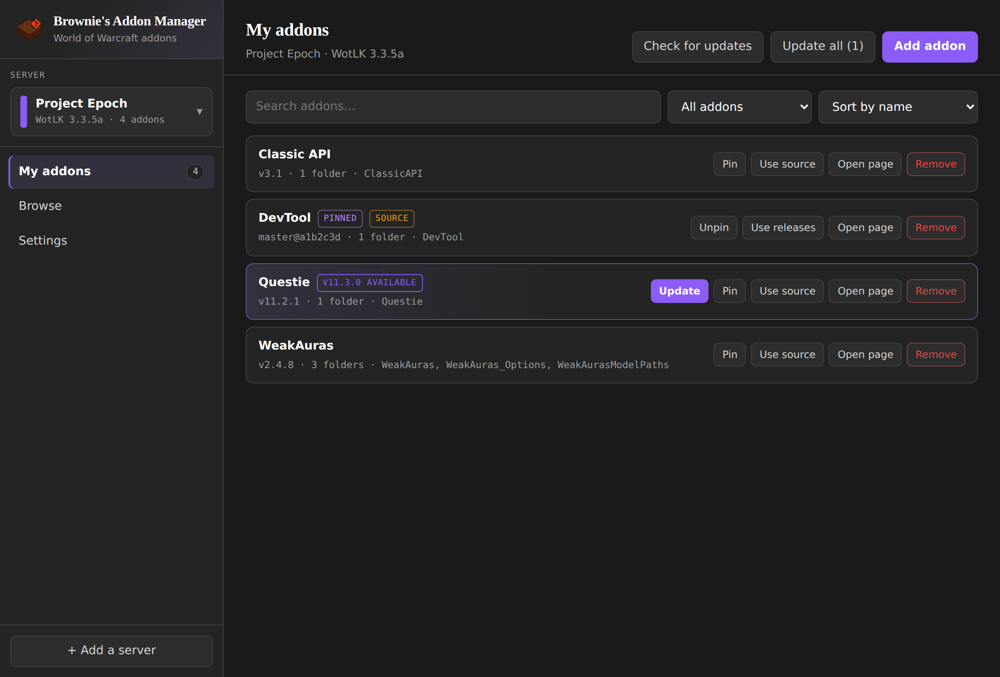
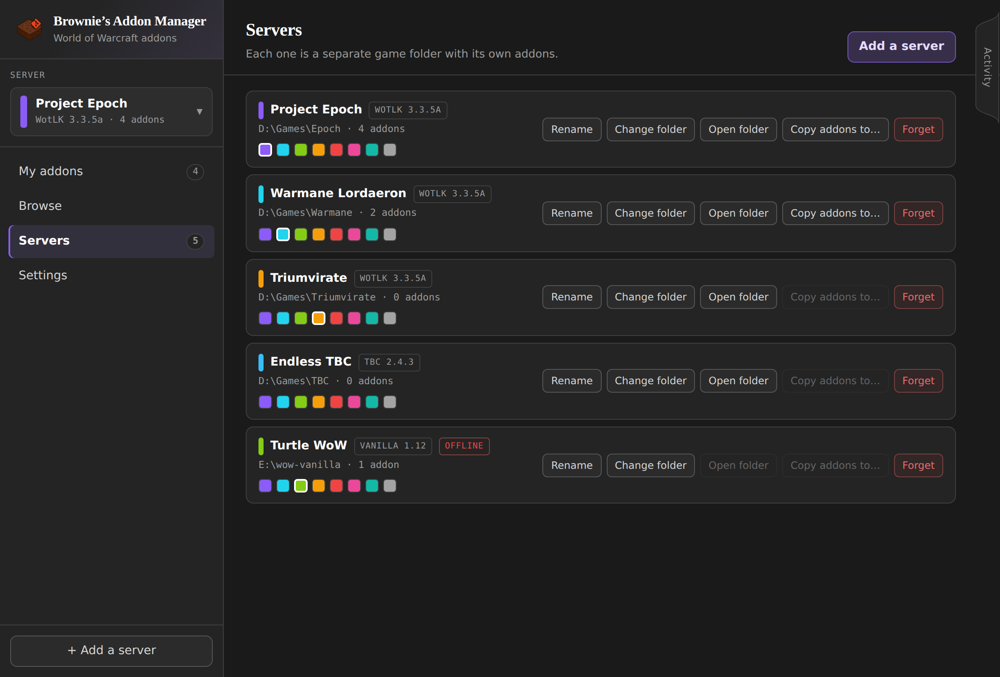
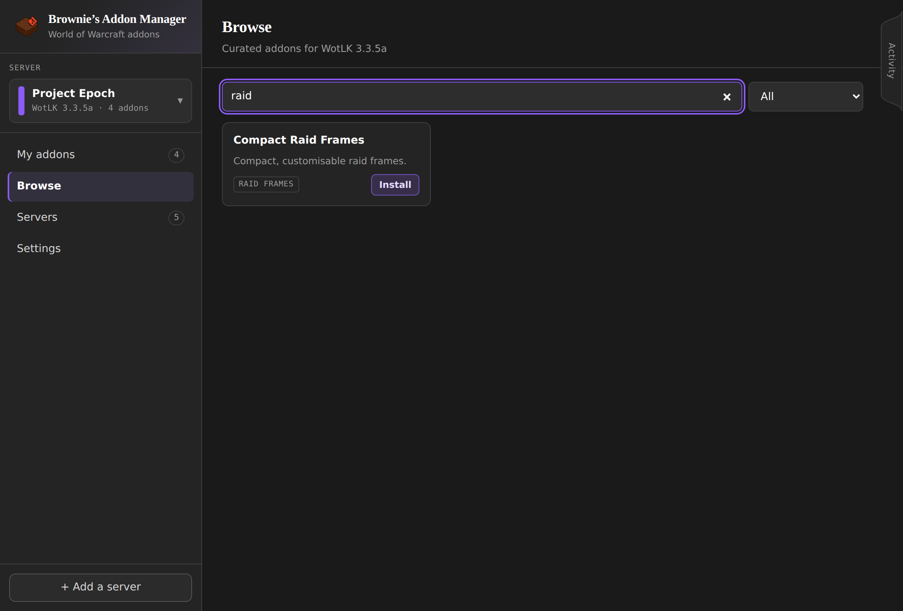
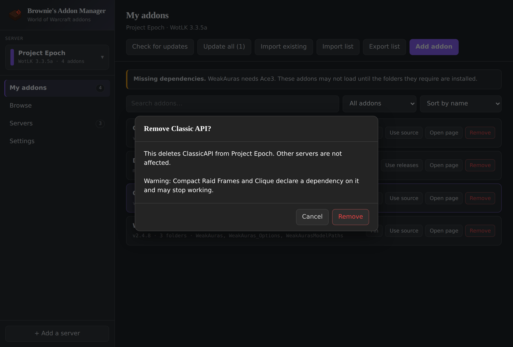
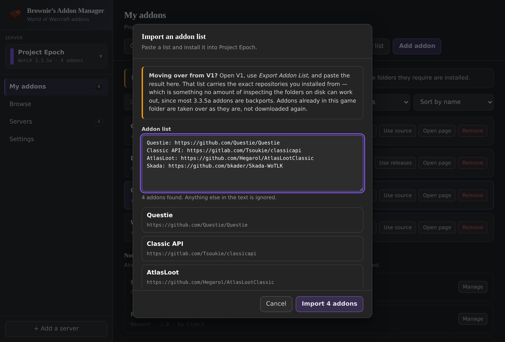

<div align="center">



# Brownie’s Addon Manager

**Install and update World of Warcraft addons from GitHub and GitLab —
across as many game folders as you run.**

[](https://github.com/LoneBrownie/AddonManager/releases/latest)
[](#installing)
[](#installing)
[](LICENSE)
[](#building-it-yourself)

</div>

---

> [!NOTE]
> **V2 is here.** It is a rewrite, and it installs alongside V1 rather than over
> it — see [Moving over from V1](#moving-over-from-v1). Backing up your
> `Interface/AddOns` folder before pointing any addon manager at it remains a
> good habit. If you would rather stay where you are,
> [V1 is still there](#using-v1).

---

## What it does

### Several servers, side by side

A dropdown at the top of the sidebar scopes the whole app to one game folder.
Installing an addon touches **only** the selected server. The same addon can sit
in two servers at different versions, pinned in one and auto-updating in the
other, and removing it from one never touches the other.

Running three separate 3.3.5a folders for three different private servers is a
normal thing to do here, so servers are identified by the name *you* give them
with the path shown underneath.

<div align="center">
  
</div>

### Everything else

- **GitHub and GitLab**, with a per-addon choice between tagged releases and the
  latest source build.
- **Pin an addon** to keep a version and stop it being checked at all.
- **Multi-folder addons** — `WeakAuras` and `WeakAuras_Options` are tracked as
  one thing, and removing it removes exactly the folders that were installed.
- **A curated list** of one-click installs, with dependencies resolved and
  installed first.
- **Warnings that arrive before the mistake**: an addon built for another game
  version, a folder collision that would overwrite something the app did not
  create, or removing an addon others depend on.
- **Export and import addon lists** as plain text, to share with your guild or
  move to a new machine. The list records each addon's version and folders, so
  importing it somewhere the addons already exist downloads nothing.
- **Optional GitHub token** to lift GitHub's anonymous 60-requests-an-hour API
  limit to 5,000. GitLab is asked anonymously and needs no token.
- **Update checks run in parallel** and can be cancelled.
- **Change a server's folder** when the game moves or a drive changes letter,
  keeping its name, colour and addons.
- **Addons deleted outside the app** are flagged rather than silently dropped,
  with a button to put them back.
- **Dark, light, or follow the system**, under *Settings → Appearance*.

<div align="center">
  
</div>

<details>
<summary><b>More screenshots</b></summary>

<br />

**Managing servers** — rename, recolour, forget, or copy an addon set across.



**Browsing the curated list**



**Removing an addon others depend on**



</details>

---

## Installing

Take the [latest release](https://github.com/LoneBrownie/AddonManager/releases/latest).

**Windows** — download and run the `.exe` installer.

**Linux** — an **AppImage**. Make it executable and run it; it updates itself
from inside the app.

macOS is not supported.

**Updating.** **Settings → Check for updates** finds the next release and
installs it, and nothing is downloaded until you ask for it. What changed is
shown when the app restarts.

### Where your addons go

Addons install to `Interface/AddOns` inside each server's folder, and the app
never writes anywhere else.

**Installing something new never overwrites a folder it did not create** — it
stops and tells you which folder is in the way. Updating an addon you have
already told it about is different: there you have named the repository the
folders come from, so it replaces them, including any it did not write itself.

If a folder is not writable — which usually means the game is installed under
`Program Files` — the app tells you rather than asking to restart as
Administrator.

---

## Moving over from V1

> [!IMPORTANT]
> **V2 installs alongside V1, not over the top.** It is a separate application
> with its own settings, so V1 keeps working and nothing is changed or migrated
> automatically. If you dislike V2, carry on using V1.

Bringing your addons across takes about a minute:

| | Step |
|---|---|
| **1** | In **V1**, open **My Addons → Export Addon List** and copy the text. |
| **2** | In **V2**, add your game folder as a server (Browse to it, pick the game version, name it). |
| **3** | Click **Import list**, paste, and press **Import**. |

<div align="center">
  
</div>

**Why the export rather than a folder scan?** V1 records the repository URL for
every addon it manages, so its export is the only reliable record of where your
addons actually came from. Most 3.3.5a addons are backports and forks, which
means a folder on disk cannot tell you which repository it was installed from —
an addon's own metadata usually names the *upstream* project, not the fork you
are running. Guessing would point updates at the wrong repository.

Addons already in the game folder are recognised during the import and taken
over where they stand — nothing is downloaded a second time to replace files
that are already working.

Anything V1 never managed appears at the foot of the addon list, greyed and
tagged `unmanaged`, with a **Manage** button that asks for its repository URL.

---

## Using V1

V1 still works, and its final Windows installer is on the
[v1.4.0 release](https://github.com/LoneBrownie/AddonManager/releases/tag/v1.4.0).
*Latest release* now points at V2, so use that tag rather than a `/latest` link.

Its source is on the
[`v1-archive`](https://github.com/LoneBrownie/AddonManager/tree/v1-archive)
branch. It is finished rather than maintained: it will keep working, but fixes
go into V2.

Its known issue stands: if your WoW directory is under Program Files, you need
to run it as Administrator. V2 does not have this requirement.

---

## Building it yourself

V2 is a Rust core with a React and TypeScript interface, packaged with Tauri.

```sh
npm install
npm run tauri dev        # run it
cargo test               # the engine's test suite
npm run tauri build      # produce installers for your platform
```

**Linux build dependencies:**

```sh
sudo apt install libwebkit2gtk-4.1-dev libgtk-3-dev \
  libayatana-appindicator3-dev librsvg2-dev libsoup-3.0-dev
```

You can also run the interface on its own in a browser, with an in-memory
backend and no WoW installation needed:

```sh
npm run dev
```

[`CHANGELOG.md`](CHANGELOG.md) records what changed in each release, betas
included; the release notes on GitHub are generated from it.

See [`ARCHITECTURE.md`](ARCHITECTURE.md) for how the pieces fit together,
and [`docs/v2/V2-PLAN.md`](docs/v2/V2-PLAN.md) for why V2 exists and what was
decided along the way.

---

## Contributing

The curated lists live in [`public/catalog/`](public/catalog/) — one file per
game version, with [a README](public/catalog/README.md) describing the entry
shape. Adding an addon is a small pull request.

Bug reports are welcome. **Settings → Copy diagnostics** produces a redacted
summary worth attaching; it shortens paths and never includes your token.

## Licence

[GPL-3.0-or-later](LICENSE). You can use and modify this freely; if you
distribute a modified version, it has to stay open too.

## Acknowledgments

Claude, who wrote most of V2.

My guildies for early testing.
