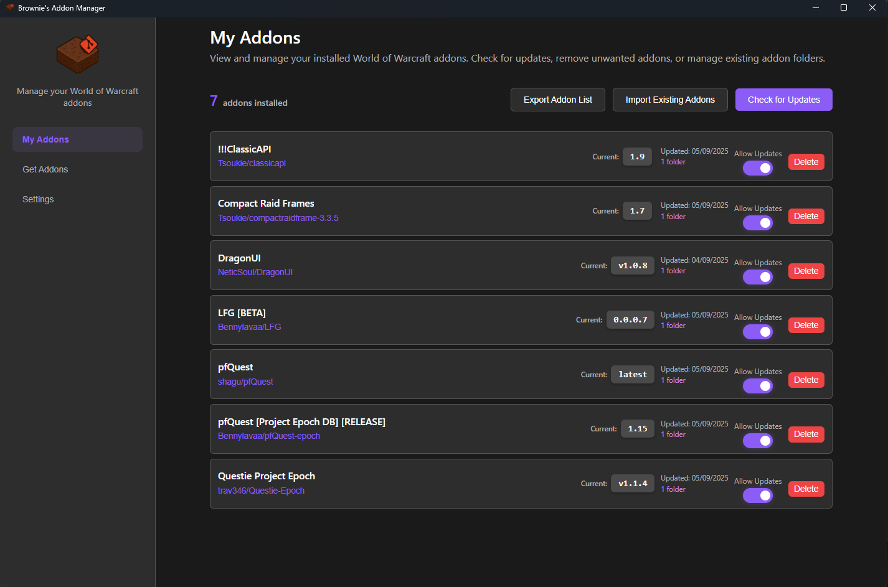

I wanted a simple addon to help with updating addons for Project Epoch so I used claude to create this.

It currently allows updating of addons from both github and gitlab. 
Provides a few addons for 3.3.5a as one-click installs.

My Addons Page

Get Addons Page

Settings
