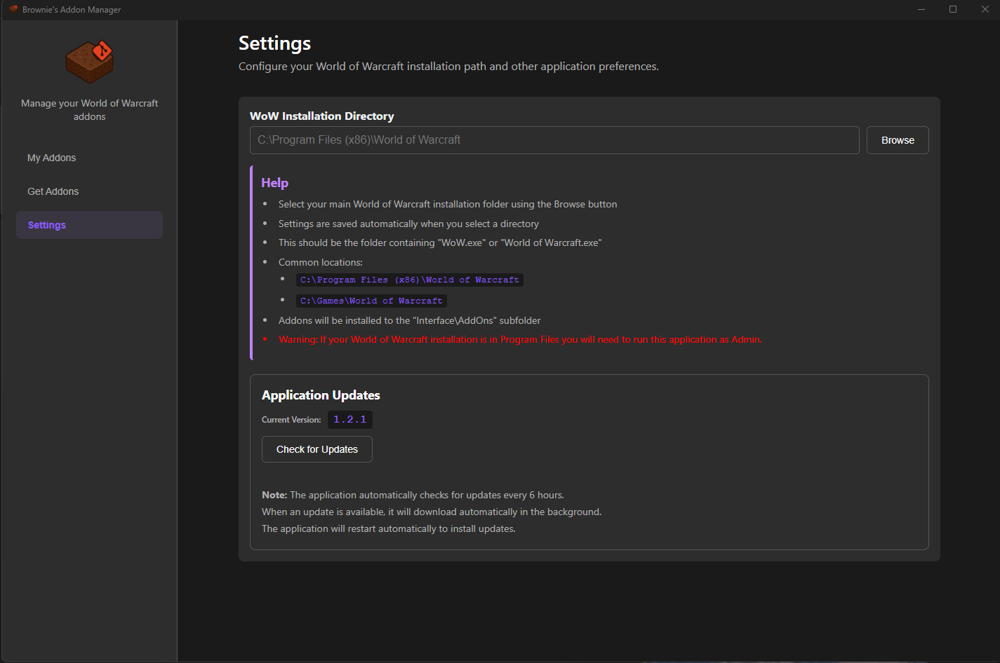

<h1>About</h1>
I wanted a simple application to help with updating addons for Project Epoch so I used claude to create this.

It currently allows installing/updating of addons from both github and gitlab. 
Provides a few addons for 3.3.5a as one-click installs.

***
<h1>Known Issues</h1>

- If your WoW directory is in Program Files then you will need to run this as admin.

Please create a github issue for any problems you find and I'll take a look at some point.

***
<h1>Installation</h1>

Download the latest Windows installer from the releases page and run it:

- Latest release (installer): https://github.com/LoneBrownie/AddonManager/releases/latest

***

<h1>Tech stack</h1>

This project is a Windows desktop app built with Electron and React. 

***

<h1>Screenshots</h1>

***
<h1>Acknowledgments</h1>
Our AI overlords Claude and ChatGPT.

My guildies for early testing.
